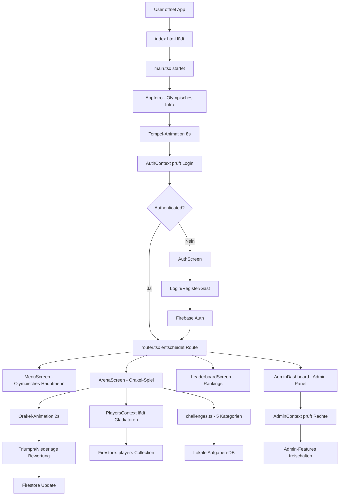

# 🏗️ MALLEX - Architektur & Datenfluss

## 🚀 Anwendungsarchitektur

### **Frontend Stack**
```
React 18 + TypeScript
    ↓
Vite (Build Tool)
    ↓  
React Router (HashRouter für Replit)
    ↓
Context API (State Management)
    ↓
CSS Modules + Olympisches Design-System
    ↓
PWA Service Worker
```

### **Backend Stack**  
```
Firebase Authentication
    ↓
Firestore Database (Real-time)
    ↓
Firebase Security Rules
    ↓
Replit Deployment
```

## 🔄 Vollständiger Datenfluss



## 📊 Context Provider Hierarchie

```
main.tsx
├── ErrorBoundary (🛡️ Fehlerbehandlung)
└── HashRouter (🔗 Replit-kompatibles Routing)
    └── AuthProvider (🔐 Authentication)
        └── PlayersProvider (👥 Spielerverwaltung + Firestore)
            └── AdminProvider (👑 Admin-Rechte)
                └── AdminSettingsProvider (⚙️ Admin-Einstellungen)  
                    └── TaskSuggestionsProvider (📝 Community-Vorschläge)
                        └── App (router.tsx)
                            └── AppIntro (🏛️ Olympisches Intro)
```

## 🎯 Feature-Module im Detail

### **🏛️ AppIntro Module (Neues Intro-System)**
```
AppIntro.tsx + AppIntro.module.css
    ↓
User klickt "Tippe, um die Spiele zu beginnen..."
    ↓
Tempel-Animation (1.2s - Türen öffnen)
    ↓
Text emerges aus Dunkelheit (2.5s)
    ↓
"DIE OLYMPISCHEN SAUFSPIELE" erscheint
    ↓
Auto-Weiterleitung nach 8s → MenuScreen

Animation-Features:
├── Olympischer Himmel mit Wolken
├── Marmor-Tempel mit Gold-Inschrift
├── Perspektivische Türen-Animation
└── Emergierender Text mit 3D-Effekt
```

### **⚔️ Arena Module (Erweitert)**
```
features/Arena/
├── ArenaScreen.tsx        # UI mit Orakel-System
├── categories.ts          # 5 Olympische Kategorien
└── challenges.ts          # 150+ Aufgaben-Datenbank

Erweiterte Spiellogik:
User klickt "⚔️ IN DIE ARENA! ⚔️"
    ↓
Orakel-Spinning Animation (2s)
    ↓  
getRandomPlayer() + getRandomChallenge()
    ↓
Challenge-Card mit Kategorie-Icon
    ↓
🏆 TRIUMPH / 💀 NIEDERLAGE Buttons
    ↓
Punkte-System: +3/+1/-1 Arena-Punkte
    ↓
Real-time Firestore Update
    ↓
Gladiatoren-Anzeige aktualisiert
```

### **🌍 Internationalisierung System**
```
i18n/
├── de.json (Hauptsprache)    # Olympische Deutsche Begriffe
├── en.json                   # Englische Übersetzung
├── es.json                   # Spanische Übersetzung
├── fr.json                   # Französische Übersetzung
└── index.ts                  # i18n-Konfiguration

Aufgaben-Übersetzungen:
categories: {
  "fate": "🎭 Fatum - Schicksal der Götter",
  "shame": "🔥 Pudor - Prüfung der Schande", 
  "seduce": "💘 Venus - Kunst der Verführung",
  "escalate": "⚡ Bacchus - Rausch der Eskalation",
  "confess": "🗿 Veritas - Bekenntnis der Wahrheit"
}
```

### **👑 Admin System (Vollständig)**
```
AdminContext prüft Benutzerrechte
    ↓
RequireAdmin Guard schützt Routen
    ↓ 
AdminDashboard zeigt Module:
    ├── 👥 Spielerverwaltung (CRUD)
    ├── 📝 Aufgaben-Management  
    ├── 💡 Vorschläge-Moderation
    ├── ⚙️ System-Einstellungen
    └── 📊 Statistiken & Analytics

Security Flow:
Firebase Auth Token → isAdmin Check → Route Access
```

## 🔄 Erweiterte State Management Patterns

### **PlayersContext mit Firestore Real-time**
```typescript
// Real-time Spieler-Synchronisation
useEffect(() => {
  const playersQuery = query(
    collection(db, 'players'),
    orderBy('arenaPoints', 'desc')  // Sortiert nach Arena-Punkten
  )
  
  const unsubscribe = onSnapshot(playersQuery, (snapshot) => {
    const playersData = snapshot.docs.map(doc => ({
      id: doc.id,
      ...doc.data(),
      createdAt: doc.data().createdAt?.toDate()
    }))
    setPlayers(playersData)  // Automatische UI-Updates
  })
  
  return unsubscribe  // Cleanup on unmount
}, [user])

// Arena-Punkte Update
const updateArenaPoints = async (playerId: string, change: number) => {
  const playerRef = doc(db, 'players', playerId)
  await updateDoc(playerRef, {
    arenaPoints: increment(change),
    totalGames: increment(1),
    lastGame: new Date()
  })
}
```

### **TaskSuggestionsContext für Community**
```typescript
// Community-Vorschläge System
const suggestTask = async (taskData: TaskSuggestion) => {
  await addDoc(collection(db, 'taskSuggestions'), {
    ...taskData,
    status: 'pending',
    submittedBy: user.uid,
    submittedAt: new Date()
  })
}

// Admin-Moderation
const moderateTask = async (suggestionId: string, action: 'approve' | 'reject') => {
  const suggestionRef = doc(db, 'taskSuggestions', suggestionId)
  
  if (action === 'approve') {
    // Task zur Haupt-DB hinzufügen
    await addDoc(collection(db, 'tasks'), approvedTaskData)
  }
  
  await updateDoc(suggestionRef, { 
    status: action,
    moderatedBy: user.uid,
    moderatedAt: new Date()
  })
}
```

## 🔥 Firebase Integration (Erweitert)

### **Optimiertes Firestore Datenmodell**
```
/players/{playerId}  
├── name: string
├── arenaPoints: number          # Hauptspiel-Punkte
├── totalGames: number           # Gespielte Runden
├── wins: number                 # Triumphe
├── losses: number               # Niederlagen
├── favoriteCategory: string     # Lieblings-Kategorie
├── achievements: string[]       # Errungenschaften
├── userId: string               # Besitzer
├── createdAt: timestamp
└── lastGame: timestamp

/tasks/{taskId}
├── category: 'Schicksal' | 'Schande' | 'Verführung' | 'Eskalation' | 'Beichte'
├── task: string
├── difficulty: 'easy' | 'medium' | 'hard'
├── isActive: boolean
├── useCount: number             # Wie oft verwendet
├── rating: number               # Community-Rating
├── language: 'de' | 'en' | 'es' | 'fr'
├── createdBy: string
└── createdAt: timestamp

/gameSession/{sessionId}         # Neue Collection
├── players: string[]            # Teilnehmer
├── currentRound: number
├── startedAt: timestamp
├── status: 'active' | 'finished'
└── history: GameAction[]        # Spiel-Verlauf
```

### **Erweiterte Security Rules**
```javascript
rules_version = '2'
service cloud.firestore {
  match /databases/{database}/documents {
    
    // Spieler - Vollzugriff für lokales Trinkspiel
    match /players/{playerId} {
      allow read, write: if true;
    }

    // Admin-Bereiche - Nur für Admins
    match /admin/{document=**} {
      allow read, write: if request.auth != null;
    }

    // Aufgaben - Lesen für alle, Schreiben für Admins
    match /tasks/{taskId} {
      allow read: if true;
      allow write: if request.auth != null;
    }

    // Community-Vorschläge - Vollzugriff
    match /taskSuggestions/{suggestionId} {
      allow read, write: if true;
    }

    // Spiel-Sessions - Authentifizierte Nutzer
    match /gameSession/{sessionId} {
      allow read, write: if request.auth != null;
    }

    // Fallback - Deny all
    match /{document=**} {
      allow read, write: if false;
    }
  }
}
```

## 🎨 Olympisches Design-System

### **Design-Token Hierarchie**
```css
:root {
  /* 🏛️ Olympische Hauptfarben */
  --olympic-gold: #DAA520;      # Haupt-Akzent
  --ancient-bronze: #CD7F32;    # Sekundär-Akzent  
  --marble-white: #F8F8FF;      # Hintergrund
  --temple-stone: #696969;      # Text
  --olympian-blue: #4682B4;     # Links
  --flame-red: #DC143C;         # Danger/Error
  --victory-green: #228B22;     # Success

  /* 📐 Olympische Abstände */
  --olympian-spacing: 1.618rem; # Golden Ratio
  --temple-padding: 2rem;
  --column-gap: 1.5rem;
  
  /* 🎭 Kategorien-Farben */
  --fate-purple: #8A2BE2;       # Schicksal
  --shame-red: #DC143C;         # Schande
  --seduce-pink: #FF69B4;       # Verführung
  --escalate-orange: #FF4500;   # Eskalation
  --confess-blue: #4169E1;      # Beichte
}
```

### **Responsive Mobile-First**
```css
/* 📱 Mobile First (320px+) */
.arena-container {
  padding: var(--mobile-padding);
  font-size: clamp(1rem, 4vw, 1.2rem);
}

/* 📱 Tablet (768px+) */
@media (min-width: 768px) {
  .arena-container {
    padding: var(--tablet-padding);
    display: grid;
    grid-template-columns: 1fr 2fr 1fr;
  }
}

/* 💻 Desktop (1024px+) */
@media (min-width: 1024px) {
  .arena-container {
    max-width: 1200px;
    margin: 0 auto;
  }
}
```

## 🚀 Performance Optimizations

### **Advanced Code Splitting**
```typescript
// Feature-basiertes Lazy Loading
const ArenaScreen = lazy(() => 
  import('./features/Arena/ArenaScreen').then(module => ({
    default: module.default
  }))
)

// Bundle-Analyse:
vendor.js     # React, Firebase (78kb gzipped)
app.js        # Core App Logic (45kb gzipped)  
arena.js      # Arena Feature (23kb gzipped)
admin.js      # Admin Feature (18kb gzipped)
i18n.js       # Sprach-Dateien (12kb gzipped)
```

### **Firebase Performance**
```typescript
// Firestore Optimierungen
1. enableNetwork() / disableNetwork() für Offline
2. Compound Indexes für komplexe Queries
3. onSnapshot() nur für aktive Screens
4. Connection Pooling aktiviert
5. Firestore Cache Size: 40MB

// Authentication Performance  
1. Anonymous Auth für schnelle Starts
2. Persistent Login State
3. Auto-Refresh Tokens
4. Custom Claims für Admin-Rechte
```

### **PWA Features (Erweitert)**
```javascript
// Service Worker Strategien
const CACHE_NAME = 'mallex-v1.2.0'

// App Shell Caching
self.addEventListener('install', (event) => {
  event.waitUntil(
    caches.open(CACHE_NAME).then((cache) => {
      return cache.addAll([
        '/',
        '/static/js/bundle.js',
        '/static/css/main.css',
        '/sounds/oracle-spin.mp3',
        '/manifest.json'
      ])
    })
  )
})

// Runtime Caching für Firestore
self.addEventListener('fetch', (event) => {
  if (event.request.url.includes('firestore.googleapis.com')) {
    event.respondWith(
      caches.open('firestore-cache').then(cache => {
        return fetch(event.request).then(response => {
          cache.put(event.request, response.clone())
          return response
        }).catch(() => cache.match(event.request))
      })
    )
  }
})
```

## 🔧 Development Workflow

### **Replit-optimierte Entwicklung**
```bash
# Development Server
npm run dev  # Port 5000 für Replit-Kompatibilität

# Build Process
npm run build
    ↓
TypeScript Check → ESLint → Vite Build
    ↓
Bundle Optimization → Asset Minification
    ↓  
dist/ Output für Replit Static Deploy
```

### **Testing Strategy**
```typescript
// Unit Tests für Core Logic
describe('Arena Game Logic', () => {
  test('getRandomChallenge returns valid challenge', () => {
    const challenge = getRandomChallenge()
    expect(challenge).toHaveProperty('category')
    expect(challenge.category).toBeOneOf([
      'Schicksal', 'Schande', 'Verführung', 'Eskalation', 'Beichte'
    ])
  })
})

// Integration Tests für Firebase
describe('PlayersContext Integration', () => {
  test('adds player to Firestore', async () => {
    await addPlayer('Testgladiator')
    const players = await getPlayers()
    expect(players).toContainEqual(
      expect.objectContaining({ name: 'Testgladiator' })
    )
  })
})
```

Diese erweiterte Architektur macht MALLEX zu einer professionellen, skalierbaren Trinkspiel-Plattform mit olympischem Flair! 🏛️⚔️🏆

