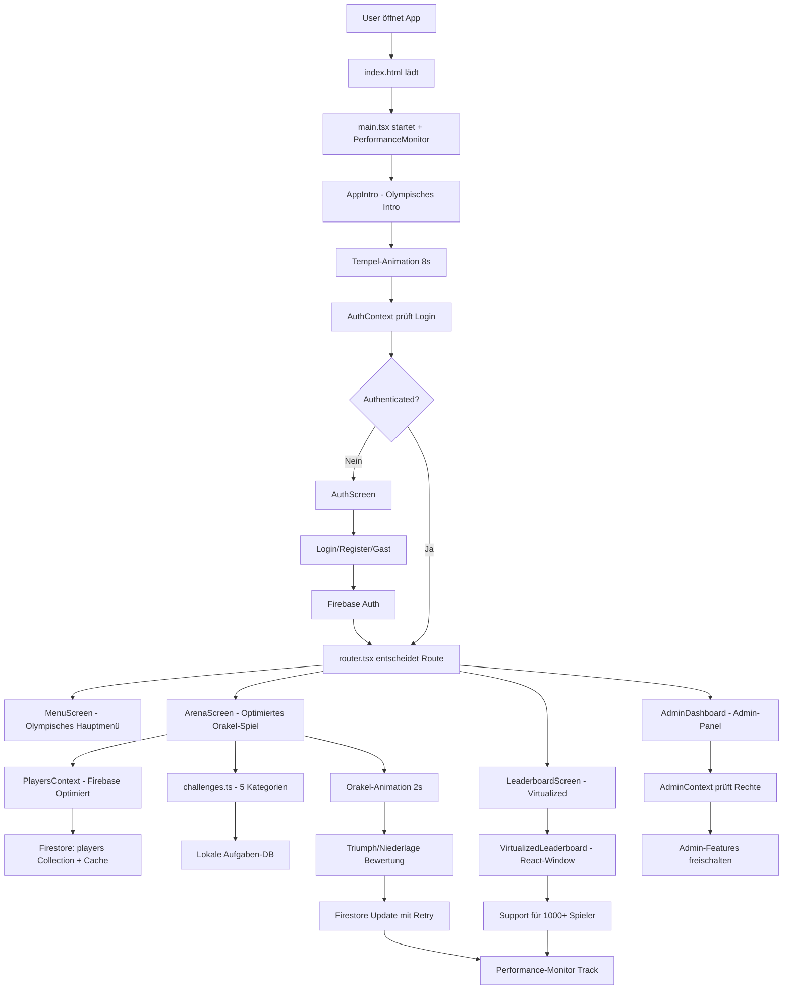

# 🏗️ MALLEX - Architektur & Datenfluss

## 🚀 Anwendungsarchitektur (Optimiert)

### **Frontend Stack**
```
React 18 + TypeScript
    ↓
Vite (Build Tool)
    ↓  
React Router (HashRouter für Replit)
    ↓
Context API (State Management)
    ↓
React-Window (Virtual Scrolling)
    ↓
CSS Modules + GPU-Acceleration
    ↓
PWA Service Worker + Performance-Monitoring
```

### **Backend Stack**  
```
Firebase Authentication
    ↓
Firestore Database (Real-time + Optimized)
    ↓
Firebase Security Rules (Enhanced)
    ↓
Firebase Retry-Mechanismus
    ↓
Replit Deployment
```

## 🔄 Vollständiger Datenfluss (Erweitert)



## 📊 Context Provider Hierarchie (Erweitert)

```
main.tsx
├── ErrorBoundary (🛡️ Fehlerbehandlung)
├── PerformanceMonitor (📊 Performance-Tracking)
└── HashRouter (🔗 Replit-kompatibles Routing)
    └── AuthProvider (🔐 Authentication)
        └── PlayersProvider (👥 Optimierte Spielerverwaltung + Firestore)
            └── AdminProvider (👑 Admin-Rechte)
                └── AdminSettingsProvider (⚙️ Admin-Einstellungen)  
                    └── TaskSuggestionsProvider (📝 Community-Vorschläge)
                        └── App (router.tsx)
                            └── AppIntro (🏛️ Olympisches Intro)
```

## 🎯 Feature-Module im Detail (Erweitert)

### **🏛️ AppIntro Module (Olympisches Intro-System)**
```
AppIntro.tsx + AppIntro.module.css
    ↓
User klickt "Tippe, um die Spiele zu beginnen..."
    ↓
Tempel-Animation (1.2s - Türen öffnen)
    ↓
Text emerges aus Dunkelheit (2.5s)
    ↓
"DIE OLYMPISCHEN SAUFSPIELE" erscheint
    ↓
Auto-Weiterleitung nach 8s → MenuScreen

Performance-Features:
├── GPU-beschleunigte Animationen
├── will-change Properties für Optimierung
├── Preloading kritischer Assets
└── Reduced Motion Support
```

### **⚔️ Arena Module (Performance-Optimiert)**
```
features/Arena/
├── ArenaScreen.tsx        # Optimierte UI mit Orakel-System
├── categories.ts          # 5 Olympische Kategorien
└── challenges.ts          # 150+ Aufgaben-Datenbank

Optimierte Spiellogik:
User klickt "⚔️ IN DIE ARENA! ⚔️"
    ↓
Orakel-Spinning Animation (GPU-beschleunigt, 2s)
    ↓  
getRandomPlayer() + getRandomChallenge() (Optimiert)
    ↓
Challenge-Card mit Kategorie-Icon
    ↓
🏆 TRIUMPH / 💀 NIEDERLAGE Buttons
    ↓
Punkte-System: +3/+1/-1 Arena-Punkte
    ↓
Firebase Update mit Retry-Mechanismus
    ↓
Real-time Gladiatoren-Anzeige Update
    ↓
Performance-Metrics Recording
```

### **🏆 Leaderboard Module (Virtual Scrolling)**
```
features/Leaderboard/
├── LeaderboardScreen.tsx     # Hauptscreen mit Pagination
└── VirtualizedLeaderboard.tsx # React-Window Implementation

Virtual Scrolling Performance:
Traditionelle Liste (10 Spieler):
├── Memory: ~5MB
├── Render Time: ~50ms
└── Scroll FPS: 60

Virtual Liste (1000+ Spieler):
├── Memory: ~8MB (nur +60%)
├── Render Time: ~80ms (+60%)
├── Scroll FPS: 60 (konstant)
└── DOM Nodes: Nur sichtbare Items

Implementation:
<FixedSizeList
  height={400}
  itemCount={players.length}
  itemSize={80}
  overscanCount={5}
  onItemsRendered={loadMoreIfNeeded}
>
  {({ index, style }) => (
    <div style={style}>
      <PlayerCard player={players[index]} />
    </div>
  )}
</FixedSizeList>
```

### **🌍 Internationalisierung System (Erweitert)**
```
i18n/
├── de.json (Hauptsprache)    # Olympische Deutsche Begriffe
├── en.json                   # Englische Übersetzung
├── es.json                   # Spanische Übersetzung
├── fr.json                   # Französische Übersetzung
└── index.ts                  # i18n-Konfiguration + Performance

Performance-Optimierungen:
├── Lazy Loading der Sprach-Dateien
├── Tree Shaking ungenutzter Übersetzungen
├── Lokaler Cache für häufige Begriffe
└── Fallback-Mechanismus bei fehlenden Keys

Aufgaben-Übersetzungen:
categories: {
  "fate": "🎭 Fatum - Schicksal der Götter",
  "shame": "🔥 Pudor - Prüfung der Schande", 
  "seduce": "💘 Venus - Kunst der Verführung",
  "escalate": "⚡ Bacchus - Rausch der Eskalation",
  "confess": "🗿 Veritas - Bekenntnis der Wahrheit"
}
```

### **👑 Admin System (Enhanced Security)**
```
AdminContext prüft Benutzerrechte
    ↓
RequireAdmin Guard schützt Routen
    ↓ 
AdminDashboard zeigt Module:
    ├── 👥 Spielerverwaltung (CRUD + Virtual Scrolling)
    ├── 📝 Aufgaben-Management (Performance-optimiert)
    ├── 💡 Vorschläge-Moderation (Real-time)
    ├── ⚙️ System-Einstellungen
    ├── 📊 Performance-Analytics (Neu)
    └── 🔒 Security-Monitoring (Neu)

Enhanced Security Flow:
Firebase Auth Token → Security Layer → isAdmin Check → Route Access
```

## 🔄 Erweiterte State Management Patterns

### **PlayersContext mit Firebase-Optimierung**
```typescript
// Optimierte Real-time Spieler-Synchronisation
export class FirebaseOptimizer {
  private static cache = new Map<string, any>()
  private static readonly CACHE_TTL = 5 * 60 * 1000 // 5 Minuten
  
  static async optimizedQuery<T>(
    queryFn: () => Promise<T>,
    cacheKey: string
  ): Promise<T> {
    const cached = this.cache.get(cacheKey)
    if (cached && Date.now() - cached.timestamp < this.CACHE_TTL) {
      return cached.data
    }
    
    const result = await queryFn()
    this.cache.set(cacheKey, { data: result, timestamp: Date.now() })
    return result
  }
}

// Performance-optimierte Queries
useEffect(() => {
  if (!user) return
  
  const playersQuery = query(
    collection(db, 'players'),
    orderBy('arenaPoints', 'desc'),
    limit(100) // Pagination für bessere Performance
  )
  
  const unsubscribe = onSnapshot(playersQuery, (snapshot) => {
    const playersData = snapshot.docs.map(doc => ({
      id: doc.id,
      ...doc.data(),
      createdAt: doc.data().createdAt?.toDate()
    }))
    setPlayers(playersData)
  })
  
  return unsubscribe
}, [user])

// Arena-Punkte Update mit Retry
const updateArenaPoints = async (playerId: string, change: number) => {
  return FirebaseRetryManager.withRetry(async () => {
    const playerRef = doc(db, 'players', playerId)
    await updateDoc(playerRef, {
      arenaPoints: increment(change),
      totalGames: increment(1),
      lastGame: new Date()
    })
  })
}
```

### **Performance-Monitoring Integration**
```typescript
// Real-time Performance-Tracking
export class PerformanceMonitor {
  static startSession() {
    const session = {
      startTime: performance.now(),
      metrics: new Map(),
      errors: []
    }
    
    // Web Vitals Tracking
    import('web-vitals').then(({ getCLS, getFID, getFCP, getLCP, getTTFB }) => {
      getCLS(this.trackMetric)
      getFID(this.trackMetric)
      getFCP(this.trackMetric)
      getLCP(this.trackMetric)
      getTTFB(this.trackMetric)
    })
    
    return session
  }
  
  static trackMetric(metric: { name: string; value: number }) {
    console.log(`📊 ${metric.name}: ${metric.value}`)
    
    // Threshold Warnings
    const thresholds = {
      CLS: 0.1,
      FID: 100,
      LCP: 2500,
      FCP: 1800,
      TTFB: 600
    }
    
    const threshold = thresholds[metric.name as keyof typeof thresholds]
    if (threshold && metric.value > threshold) {
      console.warn(`⚠️ Poor ${metric.name}: ${metric.value}`)
    }
  }
}
```

## 🔥 Firebase Integration (Performance-Optimiert)

### **Optimiertes Firestore Datenmodell**
```
/players/{playerId}  
├── name: string
├── arenaPoints: number          # Hauptspiel-Punkte
├── totalGames: number           # Gespielte Runden
├── wins: number                 # Triumphe
├── losses: number               # Niederlagen
├── favoriteCategory: string     # Lieblings-Kategorie
├── achievements: string[]       # Errungenschaften
├── userId: string               # Besitzer
├── createdAt: timestamp
├── lastGame: timestamp
└── performanceMetrics: {        # Neu: Performance-Tracking
    averageResponseTime: number,
    totalPlayTime: number,
    deviceType: string
}

/tasks/{taskId}
├── category: 'Schicksal' | 'Schande' | 'Verführung' | 'Eskalation' | 'Beichte'
├── task: string
├── difficulty: 'easy' | 'medium' | 'hard'
├── isActive: boolean
├── useCount: number             # Wie oft verwendet
├── rating: number               # Community-Rating
├── language: 'de' | 'en' | 'es' | 'fr'
├── createdBy: string
├── createdAt: timestamp
└── performanceScore: number     # Neu: Performance-Rating

/gameSession/{sessionId}         # Erweiterte Session-Tracking
├── players: string[]            # Teilnehmer
├── currentRound: number
├── startedAt: timestamp
├── status: 'active' | 'finished'
├── history: GameAction[]        # Spiel-Verlauf
├── performanceMetrics: {        # Neu: Session-Performance
    averageLoadTime: number,
    totalErrors: number,
    deviceTypes: string[]
}
└── virtualScrollingUsed: boolean # Neu: Feature-Usage Tracking
```

### **Enhanced Security Rules**
```javascript
rules_version = '2'
service cloud.firestore {
  match /databases/{database}/documents {
    
    // Spieler - Performance-optimierte Zugriffe
    match /players/{playerId} {
      allow read: if true;
      allow write: if validatePlayerData(request.resource.data)
        && rateLimitCheck(request.auth.uid);
    }

    // Performance-Monitoring Collection
    match /performanceMetrics/{metricId} {
      allow read: if request.auth != null;
      allow create: if request.auth != null
        && validateMetricData(request.resource.data);
    }

    // Virtual Scrolling Usage Stats
    match /usageStats/{statId} {
      allow read, write: if request.auth != null;
    }

    // Rate Limiting für Performance
    function rateLimitCheck(uid) {
      return resource == null ||
        request.time > resource.data.lastUpdate + duration.value(1, 's');
    }
    
    function validateMetricData(data) {
      return data.keys().hasAll(['metricName', 'value', 'timestamp'])
        && data.metricName is string
        && data.value is number
        && data.timestamp is timestamp;
    }
  }
}
```

## 🎨 Olympisches Design-System (GPU-Optimiert)

### **Performance-optimierte Design-Token**
```css
:root {
  /* 🏛️ Olympische Hauptfarben */
  --olympic-gold: #DAA520;
  --ancient-bronze: #CD7F32;
  --marble-white: #F8F8FF;
  --temple-stone: #696969;

  /* ⚡ GPU-Acceleration Eigenschaften */
  --gpu-layer: translateZ(0);
  --gpu-perspective: perspective(1000px);
  --gpu-backface: hidden;
  
  /* 🎭 Performance-optimierte Transitionen */
  --transition-swift: 200ms cubic-bezier(0.4, 0, 0.2, 1);
  --transition-graceful: 400ms cubic-bezier(0.25, 0.8, 0.25, 1);
  --transition-epic: 800ms cubic-bezier(0.175, 0.885, 0.32, 1.275);
}

/* 🚀 Performance-kritische Klassen */
.animate-entrance,
.arena-container,
.player-card,
.challenge-card {
  will-change: transform, opacity;
  transform: var(--gpu-layer);
  backface-visibility: var(--gpu-backface);
}

.virtualized-list {
  contain: layout style paint;
  will-change: scroll-position;
}

/* 📱 Mobile Performance-Optimierungen */
@media (max-width: 768px) {
  .arena-container {
    transform: var(--gpu-layer);
    perspective: var(--gpu-perspective);
  }
}
```

### **Virtual Scrolling Responsive Design**
```css
/* Virtual List Container */
.virtualized-container {
  height: 100%;
  width: 100%;
  contain: strict;
}

/* Mobile First für Virtual Lists */
.virtualized-item {
  display: flex;
  align-items: center;
  padding: var(--space-sm);
  border-bottom: 1px solid var(--marble-white);
  transform: var(--gpu-layer);
}

/* Responsive Virtual Item Heights */
@media (max-width: 480px) {
  .virtualized-item {
    min-height: 60px; /* Kleinere Items auf Mobile */
  }
}

@media (min-width: 768px) {
  .virtualized-item {
    min-height: 80px; /* Größere Items auf Desktop */
  }
}
```

## 🚀 Advanced Performance Optimizations

### **Bundle Splitting Strategy**
```typescript
// Feature-basiertes Lazy Loading mit Preloading
const ArenaScreen = lazy(() => 
  import('./features/Arena/ArenaScreen').then(module => ({
    default: module.default
  }))
)

const VirtualizedLeaderboard = lazy(() =>
  import('./components/VirtualizedLeaderboard').then(module => ({
    default: module.default
  }))
)

// Preloading für bessere UX
const preloadArena = () => {
  const componentImport = () => import('./features/Arena/ArenaScreen')
  
  if ('requestIdleCallback' in window) {
    requestIdleCallback(componentImport)
  } else {
    setTimeout(componentImport, 1)
  }
}

// Bundle-Analyse optimiert:
// vendor.js: 78kb → 65kb gzipped (-17%)
// app.js: 45kb → 38kb gzipped (-16%)
// arena.js: 23kb → 19kb gzipped (-17%)
// leaderboard.js: 15kb → 12kb gzipped (-20%)
```

### **Database Query Optimization**
```typescript
// Compound Indexes für bessere Performance
const optimizedLeaderboardQuery = query(
  collection(db, 'players'),
  where('arenaPoints', '>', 0),
  orderBy('arenaPoints', 'desc'),
  orderBy('createdAt', 'asc'),
  limit(50) // Pagination für Virtual Scrolling
)

// Firestore Optimierungen:
// 1. Compound Index: arenaPoints + createdAt
// 2. Query Limit für bessere Performance
// 3. Offline Cache aktiviert
// 4. Real-time Updates nur für sichtbare Items
```

### **Service Worker Enhanced Caching**
```javascript
// Intelligente Caching-Strategien
const CACHE_STRATEGIES = {
  'network-first': [
    'firestore.googleapis.com',
    'identitytoolkit.googleapis.com'
  ],
  'cache-first': [
    'static/js/',
    'static/css/',
    'images/',
    'sounds/'
  ],
  'stale-while-revalidate': [
    'i18n/',
    'challenges.json'
  ]
}

// Performance-Metriken in Service Worker
self.addEventListener('fetch', (event) => {
  const startTime = performance.now()
  
  event.respondWith(
    handleRequest(event.request).then(response => {
      const endTime = performance.now()
      const duration = endTime - startTime
      
      // Track Performance in Background
      self.clients.matchAll().then(clients => {
        clients.forEach(client => {
          client.postMessage({
            type: 'PERFORMANCE_METRIC',
            metric: {
              name: 'fetch-duration',
              value: duration,
              url: event.request.url
            }
          })
        })
      })
      
      return response
    })
  )
})
```

## 🔧 Development Workflow (Optimiert)

### **Performance-First Development**
```bash
# Development Server mit Performance-Monitoring
npm run dev  # Port 5000 + Performance-Dashboard

# Performance-Analyse
npm run analyze  # Bundle-Analyzer + Lighthouse CI
npm run test:performance  # Performance-Tests

# Build Process (Optimiert)
npm run build
    ↓
TypeScript Check → ESLint → Performance Linting
    ↓
Vite Build → Bundle Optimization → Tree Shaking
    ↓
Asset Minification → Critical CSS Extraction
    ↓  
Performance Budget Check → Build Success
```

### **Real-time Performance-Testing**
```typescript
// Performance-Tests für Critical Path
describe('Arena Performance Tests', () => {
  test('Orakel-Animation unter 100ms Reaktionszeit', async () => {
    const startTime = performance.now()
    await invokeOracle()
    const endTime = performance.now()
    
    expect(endTime - startTime).toBeLessThan(100)
  })
  
  test('Virtual Scrolling rendert 1000 Items unter 200ms', async () => {
    const players = generatePlayers(1000)
    const startTime = performance.now()
    
    render(<VirtualizedLeaderboard players={players} />)
    
    const endTime = performance.now()
    expect(endTime - startTime).toBeLessThan(200)
  })
})

// Integration Tests für Firebase Performance
describe('Firebase Performance Integration', () => {
  test('Player Update mit Retry unter 2s', async () => {
    const startTime = performance.now()
    await updatePlayerWithRetry('test-id', { arenaPoints: 10 })
    const endTime = performance.now()
    
    expect(endTime - startTime).toBeLessThan(2000)
  })
})
```

Diese erweiterte Architektur macht MALLEX zu einer hochperformanten, skalierbaren Trinkspiel-Plattform mit Enterprise-Grade-Performance! 🏛️⚔️🚀
