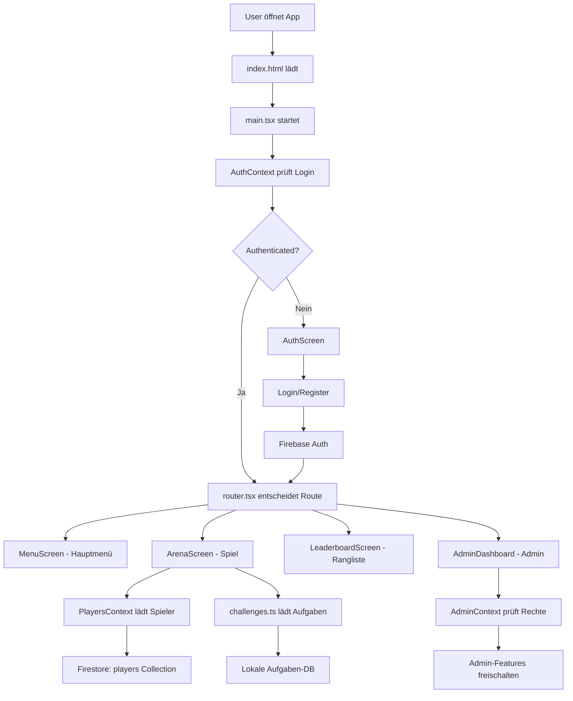

# 🏗️ MALLEX - Architektur & Datenfluss

## 🚀 Anwendungsarchitektur

### **Frontend Stack**
```
React 18 + TypeScript
    ↓
Vite (Build Tool)
    ↓  
React Router (HashRouter für Replit)
    ↓
Context API (State Management)
    ↓
CSS Modules (Styling)
```

### **Backend Stack**  
```
Firebase Authentication
    ↓
Firestore Database
    ↓
Firebase Security Rules
    ↓
PWA Service Worker
```

## 🔄 Datenfluss-Diagramm



## 📊 Context Provider Hierarchie

```
main.tsx
├── ErrorBoundary
└── HashRouter  
    └── AuthProvider (🔐 Authentication)
        └── PlayersProvider (👥 Spielerverwaltung)
            └── AdminProvider (👑 Admin-Rechte)
                └── AdminSettingsProvider (⚙️ Admin-Einstellungen)  
                    └── TaskSuggestionsProvider (📝 Aufgaben-Vorschläge)
                        └── App (router.tsx)
```

## 🎯 Feature-Module Struktur

### **Arena Module (Hauptspiel)**
```
features/Arena/
├── ArenaScreen.tsx        # UI-Component
├── categories.ts          # Kategorie-Definitionen
└── challenges.ts          # Aufgaben-Datenbank

Datenfluss:
User klickt "IN DIE ARENA!" 
    ↓
ArenaScreen.spinWheel()
    ↓  
getRandomPlayer() + getRandomChallenge()
    ↓
Orakel-Animation (2s)
    ↓
Challenge anzeigen + Bewertung
    ↓
Punkte vergeben → PlayersContext → Firestore
```

### **Authentication Flow**
```
AuthScreen → Firebase Auth → AuthContext → Router Guards

Login-Optionen:
1. Email/Password → createUserWithEmailAndPassword()
2. Gast-Modus → signInAnonymously()  
3. Fehlende ENV → Lokaler Gast-Fallback
```

### **Admin System**
```
AdminContext prüft Benutzerrechte
    ↓
RequireAdmin Guard schützt Routen
    ↓ 
AdminDashboard zeigt Admin-Features:
    ├── Spielerverwaltung
    ├── Aufgabenverwaltung  
    ├── Vorschläge-Moderation
    └── System-Einstellungen
```

## 🔄 State Management Pattern

### **Context Pattern Verwendung**
```typescript
// 1. Context Definition
const PlayersContext = createContext<PlayersContextType | null>(null)

// 2. Provider Implementation mit Firestore
export function PlayersProvider({ children }) {
  const [players, setPlayers] = useState<Player[]>([])
  
  useEffect(() => {
    // Real-time Firestore Listener
    const unsubscribe = onSnapshot(collection(db, 'players'), (snapshot) => {
      const playersData = snapshot.docs.map(doc => ({ id: doc.id, ...doc.data() }))
      setPlayers(playersData)
    })
    return unsubscribe
  }, [])

  return (
    <PlayersContext.Provider value={{ players, addPlayer, updatePlayer }}>
      {children}  
    </PlayersContext.Provider>
  )
}

// 3. Hook für Komponenten
export const usePlayers = () => {
  const context = useContext(PlayersContext)
  if (!context) throw new Error('usePlayers must be used within PlayersProvider')
  return context
}
```

## 🔥 Firebase Integration

### **Firestore Datenmodell**
```
/users/{userId}
├── email: string
├── displayName: string  
├── isAdmin: boolean
├── createdAt: timestamp
└── lastLogin: timestamp

/players/{playerId}  
├── name: string
├── arenaPoints: number
├── totalGames: number
├── wins: number
├── losses: number
├── userId: string (Besitzer)
└── createdAt: timestamp

/tasks/{taskId}
├── category: string
├── task: string
├── difficulty: string
├── isActive: boolean
├── createdBy: string
└── createdAt: timestamp

/taskSuggestions/{suggestionId}
├── task: string
├── category: string
├── submittedBy: string
├── status: 'pending' | 'approved' | 'rejected'
└── createdAt: timestamp

/notifications/{notificationId}
├── message: string
├── type: 'system' | 'admin' | 'achievement'  
├── userId: string
├── read: boolean
└── createdAt: timestamp
```

### **Security Rules Flow**
```
User Request → Firebase Auth Token → Firestore Rules

Regel-Beispiele:
1. Nur eigene Spieler bearbeiten:
   allow update: if request.auth.uid == resource.data.userId

2. Admin-Zugriff prüfen:
   allow write: if get(/databases/$(database)/documents/users/$(request.auth.uid)).data.isAdmin == true

3. Lese-Zugriff für alle authentifizierten:
   allow read: if request.auth != null
```

## 🎨 Styling Architecture  

### **Design System Hierarchie**
```
styles/
├── tokens.css           # Design-Token (Farben, Spacing, etc.)
├── base.css            # Reset + Base-Styles
├── design-system.css   # Komponenten-Klassen
├── color-utilities.css # Utility-Klassen
├── mobile.css         # Mobile-spezifische Styles
└── index.css          # Haupt-Import

CSS Module Pattern:
Component.module.css → lokale Styles
Component.tsx imports styles → scoped CSS
```

### **Responsive Design Flow**
```
Mobile First Approach:
Base Styles (320px+)
    ↓
Tablet Breakpoint (@media min-width: 768px)
    ↓  
Desktop Breakpoint (@media min-width: 1024px)
    ↓
Large Desktop (@media min-width: 1440px)
```

## 🚀 Build & Deployment Pipeline

### **Development Flow**
```
npm run dev
    ↓
Vite Dev Server (Port 5000)
    ↓
Hot Module Replacement
    ↓
TypeScript Compilation
    ↓
CSS Module Processing
    ↓  
Live Reload
```

### **Production Build**
```  
npm run build
    ↓
TypeScript Check
    ↓
Vite Build (Bundle + Optimize)
    ↓
CSS Minification
    ↓
Asset Optimization
    ↓
dist/ Output für Replit Deploy
```

### **PWA Features**
```
Service Worker (sw.js)
    ↓
Cache Strategy: 
├── App Shell (HTML/CSS/JS)
├── Static Assets  
└── Runtime Caching

Offline Fallbacks:
├── Navigation verfügbar
├── Cached Spieler-Daten
└── Lokale Challenge-DB
```

## 🔧 Performance Optimizations

### **Code Splitting**
```typescript
// Lazy Loading aller Screens
const ArenaScreen = lazy(() => import('./features/Arena/ArenaScreen'))
const MenuScreen = lazy(() => import('./features/Menu/MenuScreen'))

// Bundle Splitting:
vendor.js     # React, Firebase, Third-party
app.js        # App Logic  
arena.js      # Arena Feature
admin.js      # Admin Feature
```

### **Firebase Optimizations**
```typescript
// Firestore Performance
1. Compound Indexes für Queries
2. Real-time Listener nur wenn nötig
3. Offline Persistence aktiviert
4. Connection Pooling

// Authentication
1. Anonymous Auth für Gäste
2. Persistent Login State
3. Auto-Refresh Tokens
```

Diese Architektur sorgt für eine saubere Trennung der Verantwortlichkeiten, optimale Performance und gute Skalierbarkeit! 🏆
