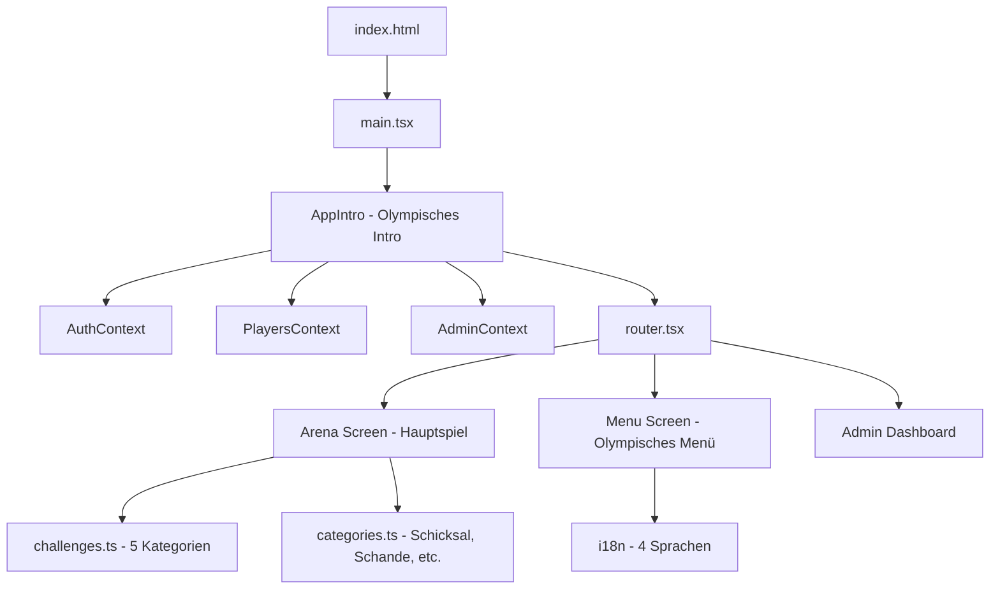

# 🏛️ MALLEX - Projektstruktur & Dateibaum

## 📁 Kompletter Dateibaum

```
MALLEX/
├── 📁 .config/                    # Replit Konfiguration
├── 📁 attached_assets/            # Anhänge und Assets
├── 📁 docs/                       # Projektdokumentation
│   ├── 📄 ARCHITECTURE_FLOW.md    # Architektur & Datenfluss
│   ├── 📄 FILE_DETAILS.md         # Detaillierte Datei-Erklärungen
│   └── 📄 PROJECT_STRUCTURE.md    # Diese Datei - Projektstruktur
├── 📁 public/                     # Öffentliche Dateien (statisch)
│   ├── 📁 sounds/                 # Audio-Dateien für Sound-Effekte
│   ├── 📄 manifest.json           # PWA Manifest für App-Installation
│   └── 📄 sw.js                   # Service Worker für Offline-Funktionen
├── 📁 src/                        # Hauptquellcode
│   ├── 📁 components/             # Wiederverwendbare UI-Komponenten
│   │   ├── 📄 AppIntro.module.css # Intro-Animation Styles
│   │   ├── 📄 AppIntro.tsx        # Olympisches Intro mit Tempel-Animation
│   │   ├── 📄 BottomNavigation.module.css
│   │   ├── 📄 BottomNavigation.tsx # Mobile Tab-Navigation
│   │   ├── 📄 ErrorBoundary.tsx   # React Error Boundary
│   │   ├── 📄 HamburgerMenu.module.css
│   │   ├── 📄 HamburgerMenu.tsx   # Hamburger-Menü für Mobile
│   │   ├── 📄 LazyLoader.tsx      # Loading-Komponente
│   │   ├── 📄 ModernButton.tsx    # Design-System Button
│   │   ├── 📄 ModernChoice.tsx    # Choice/Select Komponente
│   │   ├── 📄 ModernInput.tsx     # Input-Feld Komponente
│   │   ├── 📄 NotificationCenter.module.css
│   │   └── 📄 NotificationCenter.tsx # Benachrichtigungssystem
│   ├── 📁 config/                 # Konfigurationsdateien
│   │   └── 📄 menuItems.ts        # Menü-Konfiguration
│   ├── 📁 context/                # React Context für State Management
│   │   ├── 📄 AdminContext.tsx    # Admin-Rechte Management
│   │   ├── 📄 AdminSettingsContext.tsx # Admin-Einstellungen
│   │   ├── 📄 AuthContext.tsx     # Authentication State
│   │   ├── 📄 PlayersContext.tsx  # Spielerverwaltung mit Firestore
│   │   └── 📄 TaskSuggestionsContext.tsx # Aufgaben-Vorschläge
│   ├── 📁 features/               # Feature-basierte Screens
│   │   ├── 📁 Admin/              # Admin-Bereich
│   │   │   ├── 📄 AdminDashboard.module.css
│   │   │   └── 📄 AdminDashboard.tsx # Haupt-Admin-Dashboard
│   │   ├── 📁 Arena/              # Hauptspiel-Arena
│   │   │   ├── 📄 ArenaScreen.tsx # Hauptspiel mit Orakel-System
│   │   │   ├── 📄 categories.ts   # Aufgaben-Kategorien Definition
│   │   │   └── 📄 challenges.ts   # Aufgaben-Datenbank (5 Kategorien)
│   │   ├── 📁 Auth/               # Authentifizierung
│   │   │   ├── 📄 AuthScreen.module.css
│   │   │   └── 📄 AuthScreen.tsx  # Login/Register/Gast-Modus
│   │   ├── 📁 Leaderboard/        # Rangliste
│   │   │   ├── 📄 LeaderboardScreen.module.css
│   │   │   └── 📄 LeaderboardScreen.tsx # Spieler-Rankings
│   │   ├── 📁 Legends/            # Hall of Fame
│   │   │   ├── 📄 LegendsScreen.module.css
│   │   │   └── 📄 LegendsScreen.tsx # Legendäre Spieler
│   │   ├── 📁 Menu/               # Hauptmenü
│   │   │   ├── 📄 MenuScreen.module.css
│   │   │   └── 📄 MenuScreen.tsx  # Olympisches Hauptmenü
│   │   └── 📁 Tasks/              # Aufgabenverwaltung
│   │       ├── 📄 AdminTasksScreen.module.css
│   │       ├── 📄 AdminTasksScreen.tsx # Admin Aufgaben-Management
│   │       ├── 📄 SuggestTaskScreen.module.css
│   │       ├── 📄 SuggestTaskScreen.tsx # Community Aufgaben-Vorschläge
│   │       ├── 📄 TasksOverviewScreen.module.css
│   │       └── 📄 TasksOverviewScreen.tsx # Aufgaben-Übersicht
│   ├── 📁 hooks/                  # Custom React Hooks
│   │   └── 📄 useSwipe.ts         # Swipe-Gesten für Mobile
│   ├── 📁 i18n/                   # Internationalisierung (4 Sprachen)
│   │   ├── 📄 de.json             # Deutsch (Hauptsprache)
│   │   ├── 📄 en.json             # Englisch
│   │   ├── 📄 es.json             # Spanisch
│   │   ├── 📄 fr.json             # Französisch
│   │   └── 📄 index.ts            # i18n-Konfiguration
│   ├── 📁 layouts/                # Layout-Komponenten
│   │   ├── 📄 TabLayout.module.css
│   │   └── 📄 TabLayout.tsx       # Tab-basierte Layouts
│   ├── 📁 lib/                    # Utility-Bibliotheken
│   │   ├── 📄 a11y.ts             # Accessibility Utilities
│   │   ├── 📄 date.ts             # Datum-Utilities
│   │   ├── 📄 firebase.ts         # Firebase Konfiguration
│   │   ├── 📄 options.ts          # App-Optionen
│   │   ├── 📄 paths.ts            # Route-Definitionen
│   │   ├── 📄 tasksApi.ts         # Aufgaben-API
│   │   └── 📄 userApi.ts          # Benutzer-API
│   ├── 📁 routes/                 # Routing-Logik
│   │   └── 📁 guards/
│   │       └── 📄 RequireAdmin.tsx # Admin-Route-Guard
│   ├── 📁 styles/                 # Globale Styles (Olympisches Design)
│   │   ├── 📄 base.css            # Reset & Base-Styles
│   │   ├── 📄 color-utilities.css # Farb-Utility-Klassen
│   │   ├── 📄 design-system.css   # Design-System-Komponenten
│   │   ├── 📄 index.css           # Haupt-CSS-Import
│   │   ├── 📄 mobile.css          # Mobile-spezifische Styles
│   │   └── 📄 tokens.css          # Design-Token (Olympische Farben)
│   ├── 📁 types/                  # TypeScript Typdefinitionen
│   ├── 📁 utils/                  # Utility-Funktionen
│   │   └── 📄 dateUtils.ts        # Datum-Utility-Funktionen
│   ├── 📄 global.d.ts             # Globale TypeScript-Deklarationen
│   ├── 📄 main.tsx                # App-Einstiegspunkt
│   ├── 📄 router.tsx              # Routing-Konfiguration
│   └── 📄 vite-env.d.ts           # Vite Umgebungstypen
├── 📄 .env.example                # Beispiel-Umgebungsvariablen
├── 📄 .gitignore                  # Git Ignore-Regeln
├── 📄 .replit                     # Replit-Konfiguration
├── 📄 README.md                   # Projekt-Dokumentation
├── 📄 capacitor.config.ts         # Mobile App Konfiguration
├── 📄 firebase.json               # Firebase Projekt-Konfiguration
├── 📄 firestore.indexes.json     # Firestore Index-Definitionen
├── 📄 firestore.rules            # Firestore Sicherheitsregeln
├── 📄 generated-icon.png          # App-Icon
├── 📄 index.html                  # HTML-Einstiegspunkt
├── 📄 package-lock.json           # NPM Dependency Lock
├── 📄 package.json                # NPM Konfiguration
├── 📄 tsconfig.json               # TypeScript Konfiguration
├── 📄 tsconfig.node.json          # TypeScript Node Konfiguration
└── 📄 vite.config.ts              # Vite Build-Konfiguration
```

## 🚀 App-Startablauf

**1. index.html** → **2. main.tsx** → **3. AppIntro** → **4. router.tsx** → **5. Features/**

### Reihenfolge beim App-Start:
1. `index.html` lädt den React-Root
2. `main.tsx` initialisiert die App mit Contexts
3. `AppIntro.tsx` zeigt olympisches Intro mit Tempel-Animation
4. `router.tsx` bestimmt welcher Screen geladen wird
5. Features werden lazy-geladen je nach Route

## 📊 Architektur-Übersicht



## 🎮 Feature-Module

### **🏛️ Arena (Hauptspiel)**
Das Herzstück der App mit olympischem Orakel-System:
- **5 Kategorien:** Schicksal, Schande, Verführung, Eskalation, Beichte
- **Orakel-Animation:** 2s Spinning-Effekt
- **Triumph/Niederlage:** Bewertungssystem mit Punkten

### **👑 Admin-System**
Vollständiges Admin-Dashboard:
- Spielerverwaltung
- Aufgaben-Management
- Vorschläge-Moderation
- System-Einstellungen

### **🌍 Internationalisierung**
4-sprachige Unterstützung:
- 🇩🇪 Deutsch (Hauptsprache)
- 🇬🇧 Englisch
- 🇪🇸 Spanisch  
- 🇫🇷 Französisch

### **📱 Mobile-First Design**
Optimiert für Trinkspiel-Umgebung:
- Touch-optimierte Navigation
- Swipe-Gesten
- PWA-Funktionalität
- Offline-Support

## 🔥 Firebase Integration

### **Firestore Collections:**
```
/players/{playerId}        # Spielerdaten mit Arena-Punkten
/tasks/{taskId}           # Admin-verwaltete Aufgaben
/taskSuggestions/{id}     # Community-Vorschläge
/admin/{document}         # Admin-Einstellungen
/games/{gameId}          # Spiel-Sessions
```

### **Authentication:**
- Email/Password Login
- Anonymer Gast-Modus
- Lokaler Fallback bei fehlenden ENV-Variablen

## 🎨 Design-System

### **Olympisches Theme:**
- **Gold:** `#DAA520` (Primärfarbe)
- **Bronze:** `#CD7F32` (Sekundärfarbe)
- **Marmor:** `#F8F8FF` (Hintergrund)
- **Tempel-Stein:** `#696969` (Text)

### **Komponenten:**
- `ModernButton` - Olympic-styled Buttons
- `ModernInput` - Formulareingaben
- `AppIntro` - Epische Tempel-Intro-Animation
- `BottomNavigation` - Mobile Tab-Navigation

Diese Struktur macht MALLEX zu einer vollständigen, professionellen Trinkspiel-App! 🏆🍻

