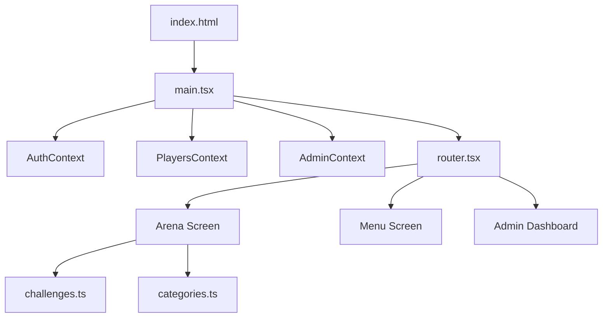

# 🏛️ MALLEX - Projektstruktur & Dateibaum

## 📁 Kompletter Dateibaum

```
MALLEX/
├── 📁 .config/                    # Replit Konfiguration
├── 📁 attached_assets/            # Anhänge und Assets
├── 📁 public/                     # Öffentliche Dateien (statisch)
│   ├── 📄 manifest.json           # PWA Manifest für App-Installation
│   └── 📄 sw.js                   # Service Worker für Offline-Funktionen
├── 📁 src/                        # Hauptquellcode
│   ├── 📁 components/             # Wiederverwendbare UI-Komponenten
│   │   ├── 📄 BottomNavigation.module.css
│   │   ├── 📄 BottomNavigation.tsx
│   │   ├── 📄 ErrorBoundary.tsx
│   │   ├── 📄 HamburgerMenu.module.css
│   │   ├── 📄 HamburgerMenu.tsx
│   │   ├── 📄 LazyLoader.tsx
│   │   ├── 📄 ModernButton.tsx
│   │   ├── 📄 ModernChoice.tsx
│   │   ├── 📄 ModernInput.tsx
│   │   ├── 📄 NotificationCenter.module.css
│   │   └── 📄 NotificationCenter.tsx
│   ├── 📁 config/                 # Konfigurationsdateien
│   │   └── 📄 menuItems.ts
│   ├── 📁 context/                # React Context für State Management
│   │   ├── 📄 AdminContext.tsx
│   │   ├── 📄 AdminSettingsContext.tsx
│   │   ├── 📄 AuthContext.tsx
│   │   ├── 📄 PlayersContext.tsx
│   │   └── 📄 TaskSuggestionsContext.tsx
│   ├── 📁 features/               # Feature-basierte Screens
│   │   ├── 📁 Admin/              # Admin-Bereich
│   │   │   ├── 📄 AdminDashboard.module.css
│   │   │   ├── 📄 AdminDashboard.tsx
│   │   │   ├── 📄 AdminSuggestionsScreen.module.css
│   │   │   └── 📄 AdminSuggestionsScreen.tsx
│   │   ├── 📁 Arena/              # Hauptspiel-Arena
│   │   │   ├── 📄 ArenaScreen.tsx
│   │   │   ├── 📄 categories.ts
│   │   │   └── 📄 challenges.ts
│   │   ├── 📁 Auth/               # Authentifizierung
│   │   │   ├── 📄 AuthScreen.module.css
│   │   │   └── 📄 AuthScreen.tsx
│   │   ├── 📁 Leaderboard/        # Rangliste
│   │   │   ├── 📄 LeaderboardScreen.module.css
│   │   │   └── 📄 LeaderboardScreen.tsx
│   │   ├── 📁 Legends/            # Hall of Fame
│   │   │   ├── 📄 LegendsScreen.module.css
│   │   │   └── 📄 LegendsScreen.tsx
│   │   ├── 📁 Menu/               # Hauptmenü
│   │   │   ├── 📄 MenuScreen.module.css
│   │   │   └── 📄 MenuScreen.tsx
│   │   └── 📁 Tasks/              # Aufgabenverwaltung
│   │       ├── 📄 AdminTasksScreen.module.css
│   │       ├── 📄 AdminTasksScreen.tsx
│   │       ├── 📄 SuggestTaskScreen.module.css
│   │       ├── 📄 SuggestTaskScreen.tsx
│   │       ├── 📄 TasksOverviewScreen.module.css
│   │       └── 📄 TasksOverviewScreen.tsx
│   ├── 📁 hooks/                  # Custom React Hooks
│   │   └── 📄 useSwipe.ts
│   ├── 📁 i18n/                   # Internationalisierung
│   │   ├── 📄 de.json
│   │   ├── 📄 en.json
│   │   └── 📄 index.ts
│   ├── 📁 layouts/                # Layout-Komponenten
│   │   ├── 📄 TabLayout.module.css
│   │   └── 📄 TabLayout.tsx
│   ├── 📁 lib/                    # Utility-Bibliotheken
│   │   ├── 📄 a11y.ts
│   │   ├── 📄 date.ts
│   │   ├── 📄 firebase.ts
│   │   ├── 📄 options.ts
│   │   ├── 📄 paths.ts
│   │   ├── 📄 tasksApi.ts
│   │   └── 📄 userApi.ts
│   ├── 📁 routes/                 # Routing-Logik
│   │   └── 📁 guards/
│   │       └── 📄 RequireAdmin.tsx
│   ├── 📁 styles/                 # Globale Styles
│   │   ├── 📄 base.css
│   │   ├── 📄 color-utilities.css
│   │   ├── 📄 design-system.css
│   │   ├── 📄 index.css
│   │   ├── 📄 mobile.css
│   │   └── 📄 tokens.css
│   ├── 📁 types/                  # TypeScript Typdefinitionen
│   │   └── 📄 css-modules.d.ts
│   ├── 📁 utils/                  # Utility-Funktionen
│   │   └── 📄 dateUtils.ts
│   ├── 📄 global.d.ts             # Globale TypeScript-Deklarationen
│   ├── 📄 main.tsx                # App-Einstiegspunkt
│   ├── 📄 router.tsx              # Routing-Konfiguration
│   └── 📄 vite-env.d.ts           # Vite Umgebungstypen
├── 📄 .env.example                # Beispiel-Umgebungsvariablen
├── 📄 .gitignore                  # Git Ignore-Regeln
├── 📄 .replit                     # Replit-Konfiguration
├── 📄 README.md                   # Projekt-Dokumentation
├── 📄 capacitor.config.ts         # Mobile App Konfiguration
├── 📄 firebase.json               # Firebase Projekt-Konfiguration
├── 📄 firestore.indexes.json     # Firestore Index-Definitionen
├── 📄 firestore.rules            # Firestore Sicherheitsregeln
├── 📄 generated-icon.png          # App-Icon
├── 📄 index.html                  # HTML-Einstiegspunkt
├── 📄 package-lock.json           # NPM Dependency Lock
├── 📄 package.json                # NPM Konfiguration
├── 📄 tsconfig.json               # TypeScript Konfiguration
├── 📄 tsconfig.node.json          # TypeScript Node Konfiguration
└── 📄 vite.config.ts              # Vite Build-Konfiguration
```

## 🚀 App-Startablauf

**1. index.html** → **2. main.tsx** → **3. router.tsx** → **4. Features/**

### Reihenfolge beim App-Start:
1. `index.html` lädt den React-Root
2. `main.tsx` initialisiert die App mit Contexts
3. `router.tsx` bestimmt welcher Screen geladen wird
4. Features werden lazy-geladen je nach Route

## 📊 Architektur-Übersicht


